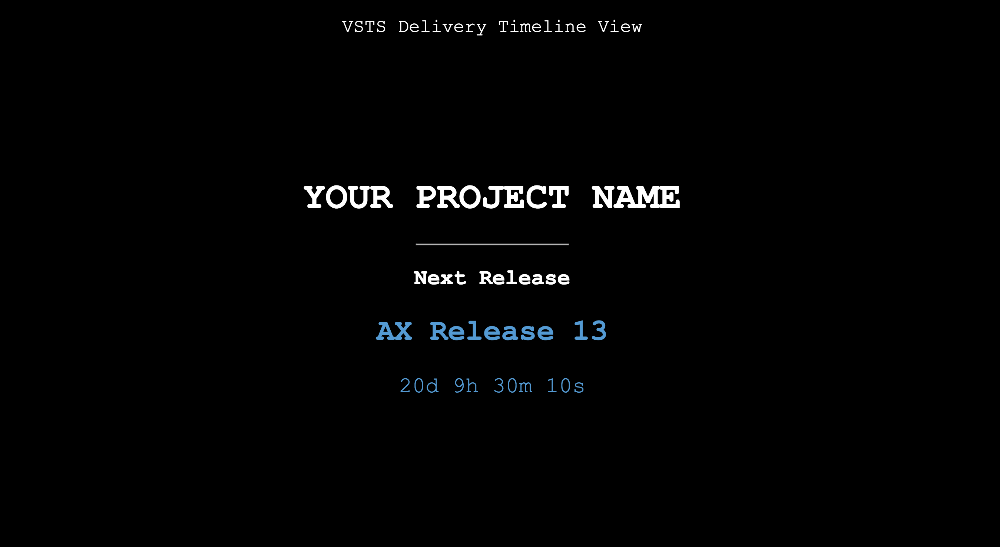

# vsts-delivery-plan
VSTS Delivery Timeline View - Dynamic Load from VSTS Plan

Following need to be updated in code:

- VSTS_TOKEN
- ACCOUNT_NAME
- PROJECT
- PLAN_ID

Ref: https://docs.microsoft.com/en-us/rest/api/vsts/work/plans/list?view=vsts-rest-4.1

**Count Down**

